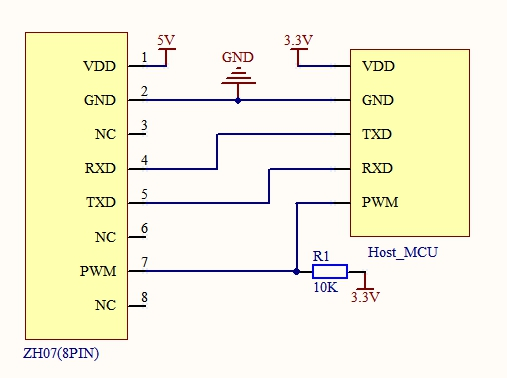
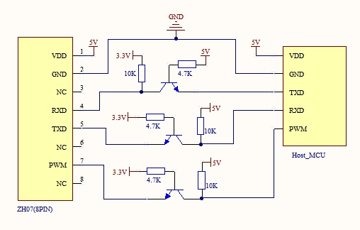

# Driver for Winsen ZH06 and ZH07 Laser dust sensor

 [ZH06](docs/ZH06.pdf) and [ZH07](docs/ZH07.pdf) are laser dust sensors module to check air quality.

# Communication modes
There are two communication modes supported
* **Initiative upload**: the sensor broadcast readings on the tty port on a regular basis
* **Question and answer**: we send a command command to request a reading

The mode is selected when requesting an instance of the sensor driver.
```go
// request an instance that will use Q&A communication mode
z0 := zh07.NewZH07q(&zh07.Config{RW: rw})
// request an instance that will use Initiative upload communication mode
z0 := zh07.NewZH07i(&zh07.Config{RW: rw})

// Init must be called to set the mode
if e := z.Init(); e != nil {
	fmt.Printf("%+v\n", e)
}
```
There is no difference from the user side on using either mode

# Sensor models & documentation
I tested the driver using a ZH07 sensor. 

There's is only documentation about the [ZH06](docs/ZH06.pdf), but the [ZH07](docs/ZH07.pdf) is fully compatible with it. The project was developed based on the ZH06 documentation and tested using a ZH07.

In theory, this driver should work with a ZH06 sensor, but I don't have any around to play with it.

# Pinout and connection
**Pin numbers and orientation**

**Pinout**
|Pin #|Use|Comment|
|-|-|-| 
|1|VDD|DC +5v|
|2|GND|Ground| 
|3|-|Not connected| 
|4|RXD|TTL@3.3v| 
|5|TXD|TTL@3.3v| 
|6|-|Not connected
|7|-|Not connected
|8|PWM|TTL@3.3v| 
> DC 5v must be used to power the sensor as it's needed to drive the internal fan

**Typical connection to a MCU that works with 3.3v**


**Typical connection to a device that works with 5v**
Some level shifting method is required


**Connect to a Raspberry Pi**

# Golang usage
```go
package main

import (
	"bufio"
	"fmt"
	"log"
	"os"

	"github.com/padiazg/go-zh07"
	"github.com/tarm/serial"
)

func main() {
    // open TTY port
    s, err := serial.OpenPort(&serial.Config{
        Name:     "/dev/serial0",
        Baud:     9600,
        Parity:   serial.ParityNone,
        StopBits: serial.Stop1,
    })
    if err != nil {
        panic(err)
    }

    // we wrap the tty port with a bufio.ReadWriter
    rw := bufio.NewReadWriter(bufio.NewReader(s), bufio.NewWriter(s))

    // create a sensor instance
    z := zh07.NewZH07q(rw)
    if e := z.Init(); e != nil {
        fmt.Fprintf(os.Stderr, "%s\n", e)
        log.Fatal(e)
    }

    r, e := z.Read()
    if e != nil {
        fmt.Printf("Reading from tty: %v\n", e)
        os.Exit(1)
    }
    fmt.Printf("Reading:\nPM 1.0: %d\nPM 2.5: %d\nPM 10 : %d\n\n", r.PM1, r.PM25, r.PM10)
}
```

A more detailed and complex example can be found at [go-zh07-example](https://github.com/padiazg/go-zh07-example)

# Contact
Please use [Github issue tracker](https://github.com/padiazg/go-zh07/issues) for filling bugs or feature requests.

# License
Go-zh07 is licensed under MIT License.