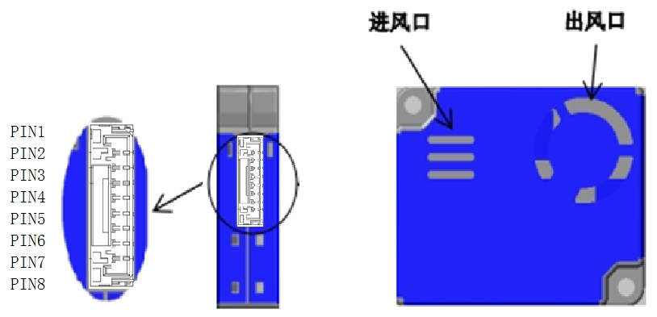
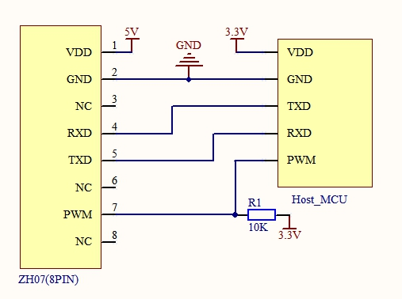
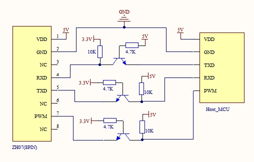

# Winsen ZH06 and ZH07 Laser dust sensor

ZH06 [pdf reference](docs/ZH06.pdf), ZH07 [pdf reference](docs/ZH07.pdf) are laser dust sensors module to check air quality.

# Communication modes
There are two communication modes supported
* **Initiative upload**: the sensor broadcast readings on the tty port on a regular basis
* **Queation and answer**: we send a command command to request a reading

The mode is selected when requesting an instance of the sensor driver.
```go
// request an instance that will use Q&A communication mode
z0, _ := zh07.NewZH07(zh07.ModeQA, rw)
// request an instance that will use Initiative upload communication mode
z1, _ := zh07.NewZH07(zh07.ModeInitiative, rw)
```
There is no difference from the user side on using either mode

# Sensor models & documentation
I tested the driver using a ZH07 sensor. 

There is no documentation in English about this model, and I could only find a [pdf](doc/ZH07.pdf) in Chinese. This document states that the communication protocol used by this sensor is the same used by the ZH06 and forwards us to its [documentation](docs/ZH07.pdf) for further development.

In theory, this driver should work with a ZH06 sensor, but I don't have any around to play with it.

# Pinout and connection
**Pin numbers and orientation**

**Pinout**
|Pin #|Use|Comment|
|-|-|-| 
|1|VDD|DC +5v|
|2|GND|Ground| 
|3|-|Not connected| 
|4|RXD|TTL@3.3v| 
|5|TXD|TTL@3.3v| 
|6|-|Not connected
|7|-|Not connected
|8|PWM|TTL@3.3v| 
> DC 5v must be used to power the sensor as it's needed to drive the internal fan

**Typical connection to a MCU that works with 3.3v**


**Typical connection to a device that works with 5v**
Some level shifting method is required


# Golang usage
```go
package main

import (
	"bufio"
	"fmt"
	"log"
	"os"

	"github.com/padiazg/go-zh07"
	"github.com/tarm/serial"
)

func main() {
    // open TTY port
    s, err := serial.OpenPort(&serial.Config{
        Name:     "/dev/serial0",
        Baud:     9600,
        Parity:   serial.ParityNone,
        StopBits: serial.Stop1,
    })
    if err != nil {
        panic(err)
    }

    // we wrap the tty port with a bufio.ReadWriter
    rw := bufio.NewReadWriter(bufio.NewReader(s), bufio.NewWriter(s))

    // create a sensor instance
    z, e := zh07.NewZH07(zh07.ModeQA, rw)
    if e != nil {
        fmt.Fprintf(os.Stderr, "%s\n", e)
        log.Fatal(e)
    }

    r, e := z.Read()
    if e != nil {
        fmt.Printf("Reading from tty: %v\n", e)
        os.Exit(1)
    }
    fmt.Printf("Reading:\nPM 1.0: %d\nPM 2.5: %d\nPM 10 : %d\n\n", r.MassPM1, r.MassPM25, r.MassPM10)
}
```

# Contact
Please use [Github issue tracker](https://github.com/padiazg/go-zh07/issues) for filing bugs or feature requests.

# License
Go-zh07 is licensed under MIT License.